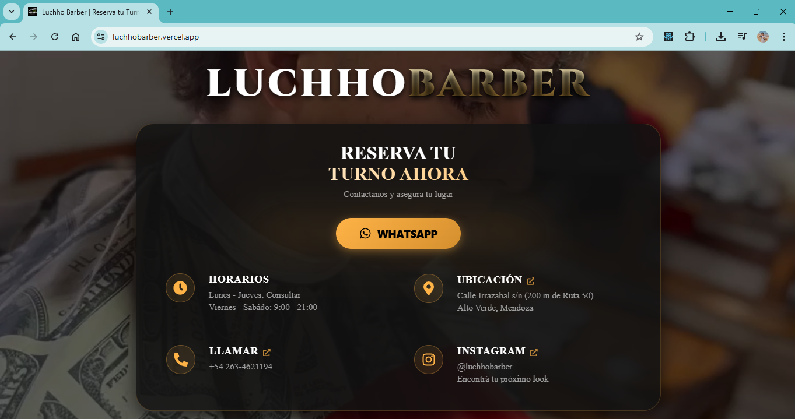

# Luchho Barber - Landing Page

> WebApp moderna para gestion de identidad y reservas de turnos, desarrollada con React y enfoque Mobile First.



## Descripcion

Este proyecto nace de una necesidad real de negocio: digitalizar la atencion al cliente de **Luchho Barber**.
El objetivo fue crear una experiencia de usuario fluida que reduzca la friccion al reservar turnos, reemplazando la gestion manual por WhatsApp con una interfaz interactiva y de alta performance.

## Stack Tecnologico

- **Core:** React.js + Vite (Build optimizado).
- **Estilos:** SASS / SCSS Modules (Arquitectura BEM).
- **Deployment:** Vercel (CI/CD).
- **Integraciones:** WhatsApp API, Google Maps.

## Funcionalidades Clave

- **Mobile First UX:** Diseno pensado priorizando la experiencia en celulares.
- **Performance:** Carga diferida de recursos y optimizacion de assets (Score 95+ en Lighthouse).
- **UI Dinamica:** Animaciones CSS, Glassmorphism y Video Background adaptativo.
- **Clean Code:** Arquitectura escalable separando logica de negocio (Orquestadores) de componentes visuales.

## Instalacion y Uso

1. Clonar el repositorio:
   ```bash
   git clone https://github.com/TU_USUARIO/luchho-barber.git
   ```
2. Instalar dependencias:
   ```bash
   npm install
   ```
3. Correr servidor de desarrollo:
   ```bash
   npm run dev
   ```

## Autor

**[Luciano Agüero]** - _Dueno & Desarrollador Fullstack_

- [https://www.linkedin.com/in/luciano-ag%C3%BCero-220828146/]
- [https://www.instagram.com/luchhobarber]

_Desarrollado como proyecto profesional y caso de estudio para la carrera de Analista de Sistemas._
